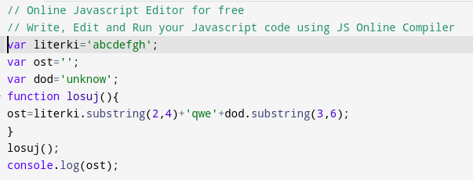

# Bezpieczeństwo aplikacji webowych
## Gra Pierwsza

Otrzymany adres URL: https://uw-team.org/hackme/level1.htm

## Level 1:

Sprawdzono kod źródłowy strony. Gdzie za metodę walidacji poprawności hasła odpowiadał skrypt JS umieszczony w kodzie HTML.
Hasłem jest 'a jednak umiem czytac'.

## Level 2:
Analogiczna sytuacja. Sprawdzamy źródło strony i odkrywamy, że warunkiem poprawnej walidacji jest porównanie wprowadzonej wartości do zmiennej <i>has</i>. 

Zmienna <i>has</i> znajduje się w pliku haselko.js, który jest publicznie dostępny. Zawartość tego pliku to:

W pliku jest widoczna zmienna has o wartości 'to bylo za proste'.

## LeveL 3:
Sprawdzamy źródło strony i widzimy bardziej skomplikowany kod:

Skupimy się na przycisku, który uruchamia funkcję walidującą sprawdz(). Kod tej funkcji to:

Widzimy, że funkcja wywołuję funkcję losuj, do niej wrócimy za chwilę. Funkcja sprawdz waliduje dostęp poprzez porównanie zmiennej <i>ost</i>.

Funkcja losuj przypisuje wartość do zmiennej <i>ost</i>.
Nastepnie kopiujemy funkcję losuj() do kompilatora JS online razem ze wszystkimi potrzebnymi zmiennymi, o które będzie krzyczał kompilator. 

Po uruchomieniu programu uzyskujemy hasło: cdqwenow.

## Level 4:
Funkcja walidacyjna ma postać:

W zadaniu chodzi o wynik matematycznych operacji, które są przypisane do zmiennej <i>wynik</i>.

Do obliczeń wykorzystamy kompilator JS.

Wynikiem operacji jest liczba 171, która jest hasłem.

## Level 5

Funkcja sprawdź wymaga aby zmienna ile wynosiła 861.
Wartość zmiennej ile jest wyznaczana za pomocą licznika czasowego podanego na stronie i zwiększającego wartość o 1 co sekundę oraz wartości zmiennej pomoc wprowadzonej przez użytkownika.
Skupmy się na wartości pomoc.

Aby lewa część tego równania mogła mieć wartość 861, czyli różną od zera, wynikiem operacji modulo musi być jeden. Dla modulo z 2 będzie to liczba nieparzysta na przykład 3.

Następnie aby równanie było spełnione musi przyjąć one następujący wzór.

861 = (seconds*(seconds-1))/2

Mamy tutaj równanie kwadratowe, którego rozwiązaniami są:
s1 = -41
s2 = 42.

Licznik nie wskazuje liczb ujemnych dlatego musi wskazywać 42 i w polu użytkownik musi wprowadzić liczbę nieparzystą np.: 3.

## Level 6

Na tym poziomie funkcja sprawdz realizuje algorytm pętli, który działając w trzech iteracjach na podstawie zmiennej licznik, która jest równa zero i inkrementowana z każdą iteracją, wykonuje sprawdzenie operacji modulo ze zmiennej licznik. 

Jeśli modulo licznik jest równe 0 znakiem dodawanym do zmiennej hsx, która będzie wartością używaną podczas walidacji, będzie '_', w przeciwnym przypadku będzie to znak 'x'.

W pętli, zmienna hsx, jest łączona z częścią wartości zmiennej lit oraz znakiem. Następnie hsx jest dzielone od 3 wartości od końca do długości ciągu znaków.

W działaniu:
lit='abcdqepolsrc'
licznik=0
hsx=''
znak=''

W pętli:
i=1
licznik=1
znak='x'
hsx='bx'

i=3
licznik=2
znak='__'
hsx='bxd_'

i=5
licznik=3
znak='x'
hsx='bxd_ex'

Po pętli następuje konkatenacja wartości hsx i jej trzech ostatnich znaków. Końcowo hsx ma postać 'bxd_ex_ex', które jest hasłem tego levelu.

## Level 7

Hasło musi wyjść 'plxszn_xrv'.
Natomiast na podstawie inputu użytkownika wykonywana jest pętla.
Należy wykonać syntezę na podstawie podanego słownika.
Gdzie p wynika z k, l z o itd.
Hasłem jest 'kocham cie'.

## Level 8

Widzimy, że w drugiej lini jest zakodowany skrypt o źródle 

%7A%73%65%64%63%78%2E%6A%73

Jest to zakodowana wiadomość za pomocą urlencode. Używając narzędzia urlencode dowiadujemy się o istnieniu na serwerze pliku: 

zsedcx.js

Następnie za pomocą URL: https://uw-team.org/hackme/passwd.js
który jest dostępny w kodzie źródłowym, podmieniamy skrypty.

ax=6
bx=3
cx=9
get=10

Dzięki tym wartościom możemy przejść przez pętlę. Po przejściu pętli wynik wynosi 'qrupjf162'.

