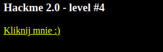

# Bezpieczeństwo aplikacji webowych
## Gra Druga

Otrzymany adres URL: https://uw-team.org/hackme/level1.htm

## Level 1:

Mamy tutaj porównanie inputu użytkownika z wartością formularza, którą jest text. Należy wprowadzić text.

## Level 2

Mamy tutaj porównanie hasła z wartością podaną w formacie urlencode.
Dekodujemy wartość '%62%61%6E%61%6C%6E%65', którą jest 'banalne'.
Hasło to: 'banalne'.

## Level 3

W trzecim zadaniu należy podać wartość decymalną wartości 10011010010, która jest zapisana w formacie binarnym.
Hasło to: 1234

## Level 4

W zadaniu 4. mamy alert, można go zatrzymać wyłączając w przeglądarce skrypty Java Script

Link prowadzi do strony twórcy gry. 
